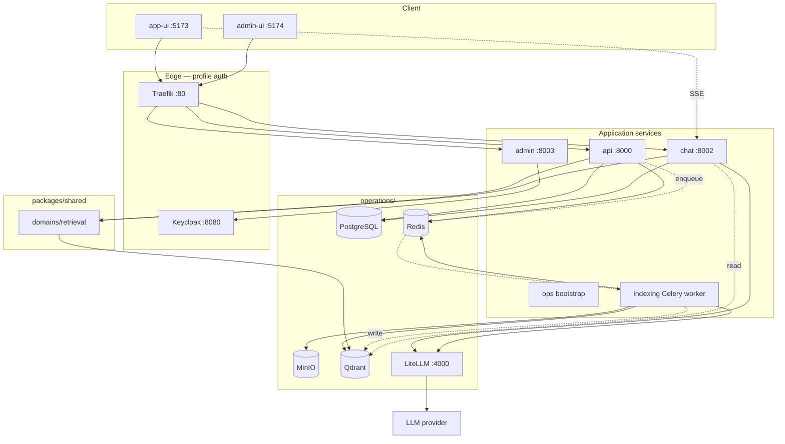

# krlybnd's - Squint

[](https://github.com/krlybnd/agentic-rag-eval/actions/workflows/ci.yml)

**Squint** is an eval-driven **agentic RAG** platform for asking questions about your own documents — built on the premise that a generated answer is worthless unless you can check it. Every response carries citations back to the exact source chunk; you can select a passage and leave a comment on it, so expert review lives on the same text the answer came from. The agent's reasoning steps are visible while it works, and answer quality is measured by an automated eval gate instead of gut feeling.

> **Why "Squint"?** Because the product is about leaning in and looking closer at the source — citations, comments on the passage, not taking the model's word for it.

## What it does

Most RAG demos stop at "upload a PDF, get an answer". Squint is built around the part that comes after that — deciding whether the answer can be trusted.

| Capability | What it means in practice |
|------------|---------------------------|
| **Answers with receipts** | Every claim links to the chunk it came from. One click opens the source text side by side with the answer. |
| **Visible reasoning** | The agent streams its steps live (planning, safety check, query rewrite, retrieval, generation), so a wrong answer can be diagnosed instead of just retried. |
| **Expert annotations** | Domain experts can select any passage in a source document and leave a comment on it, turning tacit review knowledge into stored, reusable context. |
| **Measured quality** | A golden dataset plus an automated gate scores retrieval precision/recall and answer faithfulness — regressions surface as numbers, not complaints. |
| **Guardrails by default** | PII redaction and prompt-injection detection sit in the agent's path, before anything reaches the model. |
| **Multi-tenant from day one** | Tenants and users are managed through Keycloak Organizations, with every stored record scoped to a tenant — one deployment serves many customers or departments. |
| **EU compliance hooks** | Retention windows, audit logging and AI-transparency extension points for GDPR, NIS2 and the EU AI Act. |
| **No vendor lock-in** | Model access goes through LiteLLM, and the whole stack is self-hosted, so documents and embeddings never have to leave your infrastructure. |

## Who it's for

The value shows up wherever *"the AI said so"* is not an acceptable answer.

**Regulated and high-stakes work** — legal, compliance, public sector, healthcare, finance. These teams cannot act on an unsourced summary; they need the paragraph it came from, and later they need to prove which version of which document produced a given answer.

**Internal knowledge that keeps growing** — policies, SOPs, contracts, technical documentation. New hires ask the same questions for months, and the answers live scattered across hundreds of PDFs that nobody has time to re-read.

**Research and analyst teams** — working through a paper or report collection, where the annotation layer lets a group build shared understanding on top of the same corpus instead of each person reading in isolation.

> **For reviewers:** microservice layout, LangGraph agent with guard/rewrite/retrieve/generate pipeline, shared retrieval domain lib, Celery write path, React SSE UI, **DeepEval quality gate + LangSmith tracing**. Runnable locally with Docker Compose. See [Project overview](docs/project-overview.md) and [Compliance readiness](docs/compliance.md).

## Highlights

| Area | What to look at |
|------|-----------------|
| **Core graph** | LangGraph workflow with checkpointing — `plan → guard → rewrite → retrieve → generate` ([graph](services/chat/src/agentic_chat/core/graph/)) |
| **Retrieval** | Shared domain lib in API + Chat ([ADR](docs/adr/001-why-mcp-boundary.md)) |
| **Indexing** | Semantic PDF chunking via Celery — never sync in API |
| **API design** | OpenAPI-first FastAPI, Dishka DI, vertical module slices |
| **Frontend** | React + SSE streaming chat, document upload via presigned MinIO URLs |
| **Quality** | Per-project unit tests + coverage gates; **DeepEval** live gate on `resources/` goldens; **LangSmith** prod traces |
| **Compliance** | GDPR / NIS2 / EU AI Act hooks in `core/compliance` ([doc](docs/compliance.md)) |

## Architecture



Full diagrams (context, agent graph, indexing sequence): [`docs/architecture.md`](docs/architecture.md) · docs index: [`docs/README.md`](docs/README.md)

## Stack

- **api** — documents, retrieval REST, Celery job enqueue (Dishka DI)
- **chat** — LangGraph workflow, in-process retrieval, SSE streaming
- **indexing** — semantic chunking via Celery + Redis (write path)
- **admin** — tenant/user administration via Keycloak Organizations API
- **ops** — one-shot bootstrap (Alembic migrate + MinIO setup)
- **packages/shared** — domain libs, integrations (LiteLLM, Qdrant, MinIO)
- **frontend** (app-ui `:5173`, admin-ui `:5174`) — React SSE UI (`--profile ui`)
- **PostgreSQL** · **Redis** · **MinIO** · **Qdrant** · **LiteLLM**

## Quick start

**Requirements:** Docker, Docker Compose, [uv](https://docs.astral.sh/uv/), Node 20+ (for UI)

```bash
git clone https://github.com/krlybnd/agentic-rag-eval.git
cd agentic-rag-eval

cp .env.example .env
# Set OPENAI_API_KEY in .env (needed for embeddings + chat)

make resources   # download demo PDFs into resources/ (not committed)
make up-ui       # stack + frontend (no Keycloak) on http://localhost:5173
make up-auth     # full stack + Keycloak + Traefik on http://localhost
```

1. Open the UI → upload a PDF from [`resources/`](resources/) (presigned URL → MinIO → Celery indexes it)
2. Start a chat session → ask questions about the document (SSE streaming)

### API-only demo

```bash
make up       # backend stack without UI

# Presign upload
curl -s -X POST http://localhost:8000/v1/documents/upload/presign \
  -H "X-API-Key: dev-admin-key-change-me" \
  -H "Content-Type: application/json" \
  -d '{"filename":"document.pdf"}' | tee /tmp/presign.json

UPLOAD_URL=$(jq -r .upload_url /tmp/presign.json)
DOC_ID=$(jq -r .document.id /tmp/presign.json)
curl -X PUT "$UPLOAD_URL" -H "Content-Type: application/pdf" --data-binary @resources/us-constitution.pdf
curl -X POST "http://localhost:8000/v1/documents/${DOC_ID}/complete" \
  -H "X-API-Key: dev-admin-key-change-me"

# Chat (SSE) — replace {session_id} after creating a session via API or UI
curl -N -X POST http://localhost:8002/v1/chat/sessions/{session_id}/stream \
  -H "Content-Type: application/json" \
  -d '{"message": "What is in the document?"}'
```

OpenAPI: [API docs](http://localhost:8000/docs) · [Chat docs](http://localhost:8002/docs)

## Evaluation

Goldens live in [`tests/eval/dataset.json`](tests/eval/dataset.json) and are written against the PDFs in [`resources/`](resources/) (Transformer paper, RAG paper, US Constitution, NASA fact sheets, NIST AI RMF) — not against this repository. Run `make resources` first if the PDFs are missing.

Index those documents, then:

```bash
cd tests/eval && cp .env.example .env   # set OPENAI_API_KEY to the stack LiteLLM bearer token
make eval-live                          # Tier 1 — seconds
make eval-live-generation               # Tier 2 — many LLM calls, minutes
```

The gate loads `tests/eval/.env` via the pytest `suit` fixture into `EvalSettings` + suite `SutSettings` (`EVAL_SUT_*`, localhost defaults). Same LiteLLM/Qdrant roles as the stack. Package layout: `src/agentic_eval` core (goldens, DeepEval judge model) + `modules/retrieval` (Pydantic Evals IR) / `modules/generation` (chat-graph SUT); live wiring in `tests/suit`. Generation runs `python tests/suit/run_generation_eval.py` (`evaluate()` on a TTY).

| Tier | Target | Metrics |
|------|--------|---------|
| **1 — Retrieval IR** | `make eval-live` | Recall@k, Precision@k, Hit Rate@k, MRR, nDCG@k on labeled `expected_source_file` (no judge LLM) |
| **2 — Generation** | `make eval-live-generation` (`run_generation_eval.py`) | Labeled goldens: parallel chat-graph SUT, then one DeepEval `evaluate()` (Faithfulness + Answer Relevancy, single TTY progress bar). Judge: LiteLLM **`judge`** alias (`EVAL_JUDGE_MODEL`). Abstention goldens check refusal markers. Retrieval ranking is Tier 1, not DeepEval contextual precision/recall. |

Needs indexed `resources/` PDFs, Qdrant, and LiteLLM. `EVAL_SUT_QDRANT_COLLECTION` must match the stack's `QDRANT_COLLECTION`. With `AUTH_MODE=jwt`, set `EVAL_TENANT_ID` in `tests/eval/.env` to the tenant that owns the vectors (often `tenant-a`), not `default`.

Live eval is **not** in default CI ([ADR 007](docs/adr/007-no-live-tests-in-ci.md)). Unit/lint CI: [](https://github.com/krlybnd/agentic-rag-eval/actions/workflows/ci.yml)

### Quality snapshot

GitHub renders this table in the README. Full case lists are markdown files in the repo (click through — tables and `<details>` work there). Refresh locally, then commit; numbers do not update from Actions.

[](reports/eval/retrieval.md)
[](reports/eval/generation.md)
[](reports/eval/generation.md)
[](reports/eval/generation.md)

| Gate | Score | Pass | Run |
|------|------:|-----:|-----|
| Retrieval IR (Recall / Prec / Hit / MRR / nDCG @5) | 1.00 / 1.00 / 1.00 / 1.00 / 1.00 | 20/20 | [2026-08-27 21:05](reports/eval/retrieval.md) |
| Faithfulness (threshold 0.70) | 0.95 | 18/20 | [2026-08-27 21:12](reports/eval/generation.md) |
| Answer Relevancy (threshold 0.55) | 0.90 | 19/20 | [2026-08-27 21:12](reports/eval/generation.md) |
| Abstention | — | 3/3 | [generation.md](reports/eval/generation.md) |

Index: [`reports/eval/`](reports/eval/).

## Local development

Each Python project owns its lockfile (`uv.lock`). Node projects share the root `package.json` workspaces and a single `package-lock.json`. The root `Makefile` fans out; templates live in `make/`.

```bash
make sync          # uv sync + npm ci (root) + OpenAPI export
make -C services/api dev    # :8000
make -C services/chat dev   # :8002
make dev-ui                 # :5173
```

## Makefile targets

| Target | Description |
|--------|-------------|
| `make help` | List all targets |
| `make sync` | Sync all Python + Node projects; export `openapi/*.yaml` |
| `make sync-frozen` | CI-style frozen sync (requires committed lockfiles) |
| `make test` | Unit tests (all projects) |
| `make test-unit` | Per-project unit tests + Vitest |
| `make test-unit-coverage` | Per-project coverage gates + combined HTML report |
| `make eval-live` | Retrieval IR gate (Recall@k / MRR / nDCG@k; needs indexed corpus) |
| `make eval-live-generation` | DeepEval generation gate (slow; judge LLM) |
| `make e2e` | Playwright UI BDD locally (needs `make up-ui`; not in default CI) |
| `make test-api` | Playwright API Gherkin locally (needs `make up`; OpenAPI clients only) |
| `make resources` | Download demo PDFs into `resources/` |
| `make lint` | ruff + mypy + eslint + stylelint + tsc (every project) |
| `make format` | Auto-format Python (ruff) |
| `make hooks` | Install git pre-commit hooks |
| `make up` | Start backend stack |
| `make up-ui` | Start stack + frontend |
| `make up-auth` | Full stack + Keycloak + Traefik + UI |
| `make down` | Stop all containers |
| `make ops-bootstrap` | Run migrate + MinIO bootstrap container |
| `make index` | Trigger reindex for all documents |

## CI

GitHub Actions (`.github/workflows/ci.yml`) runs on every PR and `main` push:

- **repo-map** — `project.cue` drift check
- **python-project** — ruff/mypy, unit tests + coverage gates (shared 80%, services 70%)
- **node-project** — eslint/stylelint/tsc, Vitest + coverage (ui-core 80%)
- **licenses** — CycloneDX SBOM merge + Grant policy gate (`.grant.yaml`); merged SBOM submitted to GitHub dependency graph
- **coverage-combine** — merged Python HTML report (non-gating aggregate)

`tests/eval` (offline smoke + `make eval-live`) is **not** in CI — same as e2e; see [ADR 007](docs/adr/007-no-live-tests-in-ci.md).

On successful **`main`** builds:

- [`stable`](https://github.com/krlybnd/agentic-rag-eval/releases/tag/stable) tag moves to the commit
- [Stable release](https://github.com/krlybnd/squint-genai/releases/tag/stable) gets the merged CycloneDX SBOM attached
- Merged SBOM is submitted to the [dependency graph](https://github.com/krlybnd/squint-genai/network/dependencies) (Security tab) on each successful CI run
- Combined Python unit coverage is deployed to **GitHub Pages** when available (requires a public repo or paid plan; the step is non-blocking otherwise)

PR runs upload artifacts only; they do not update `stable` or Pages.

## Current limitations (Phase 1)

Squint is a **reference architecture demo**, not a production deployment. The README capabilities table describes design intent; the gaps below are known and intentional for Phase 1:

| Area | Limitation |
|------|------------|
| **CI scope** | No live-stack suites in default CI — e2e, API acceptance, and `make eval-live` are manual/on-demand ([ADR 007](docs/adr/007-no-live-tests-in-ci.md)) |
| **Infra** | Docker Compose is dev/demo grade: default secrets, HTTP-only Traefik, floating image tags, no resource limits |
| **Guardrails** | Prompt-injection detection is still regex patterns, not a classifier; PII redaction runs on the query and retrieved context, not on model output |
| **Compliance** | GDPR / NIS2 / EU AI Act modules are extension points (NoOp stubs) — audit logging and retention are not wired end-to-end |
| **Multitenancy** | JWT prefers the `tenant_id` claim over `X-Tenant-Id`; API-key and internal-service auth still take `X-Tenant-Id` as-is (misconfiguration risk in prod) |
| **Chat streaming** | SSE token events are sliced from the finished answer, not native LLM token streaming |
| **Chunk comments** | Comments persist on the chunk and have their own vectors, but generate does not attach comment text when answering |
| **Frontend resilience** | No global React error boundary; chat state lives in a large `useChatController` hook with thin coverage ([#21](https://github.com/krlybnd/squint-genai/issues/21)) |

Run live suites locally after `make up-auth` when validating end-to-end behavior before a demo or release.

## API-first (OpenAPI)

Contract is **generated**, not hand-written:

```bash
make sync   # sync every project + export openapi/*.yaml
make -C frontend/app-ui install   # alias: npm ci at repo root; postinstall → generate:api
```

Edit routes/schemas in `services/api`, `services/chat`, or `services/admin`, then re-run `make generate-openapi`. Specs are **committed** under `openapi/`.

## Project structure

Independent Python projects (each `uv.lock`). Node apps/libs/tests share root npm workspaces:

```
package.json          root npm workspaces + package-lock.json
make/                 templates (python.mk, node.mk, projects.mk)
packages/
  shared/             agentic-shared (uv.lock)
  ui-core/            @are/ui-core
services/
  api/ chat/ admin/ indexing/   each with uv.lock + Makefile
frontend/
  app-ui/ admin-app-ui/         @are/* workspace packages
tests/
  api/ eval/ e2e/               api + e2e in npm workspaces; eval is Python
openapi/              committed OpenAPI YAML (api, chat, admin)
operations/           Postgres, Redis, MinIO, Qdrant, LiteLLM, Keycloak configs
```

`Squint` is the product name. The repository, Python packages, Docker Compose project and Keycloak realm keep their `agentic-rag-eval` identifiers, so nothing in the deployment or import paths depends on the branding.

## License

MIT — see [LICENSE](LICENSE).
