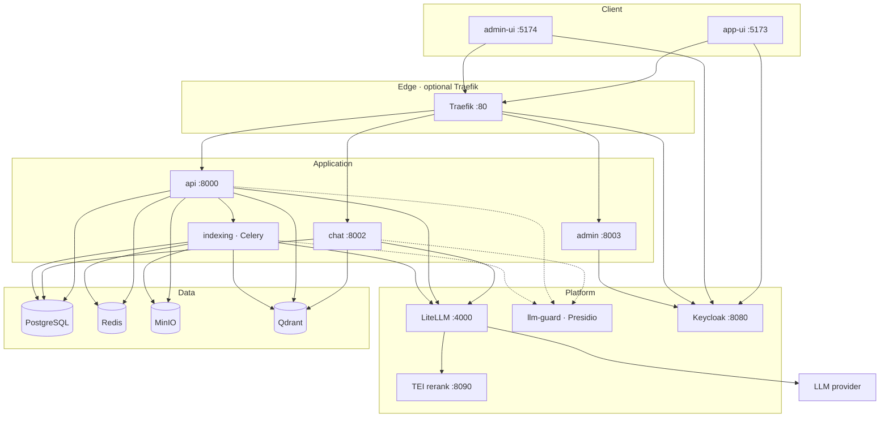

# krlybnd's - Squint

[](https://github.com/krlybnd/squint-genai/actions/workflows/ci.yml)

> **If you have 10 minutes:** the LangGraph agent in [`services/chat/.../core/graph/`](services/chat/src/agentic_chat/core/graph/) (`plan → guard → rewrite → retrieve → generate`), the deterministic PII tokenizer in [`tokenizer.py`](packages/shared/src/agentic_shared/domains/pii_vault/tokenizer.py) — why tokens preserve retrieval where masking destroys it — and the measured quality gate in [`reports/eval/`](reports/eval/). For decision-making rather than code, [ADR 011](docs/adr/011-index-time-pii-tokenization.md) is the most representative.

**Squint** is an eval-driven **agentic RAG** platform for asking questions about your own documents — built on the premise that a generated answer is worthless unless you can check it. Every response carries citations back to the exact source chunk; you can select a passage and leave a comment on it, so expert review lives on the same text the answer came from. The agent's reasoning steps are visible while it works, and answer quality is measured by an automated eval gate instead of gut feeling. Sensitive documents stay usable without leaving your infrastructure: the PII vault replaces names and identifiers with deterministic tokens before anything reaches an embedding or chat model.

[](reports/eval/investigation-retrieval.md)
[](reports/eval/investigation-generation.md)
[](reports/eval/investigation-generation.md)

Answer quality is measured, not asserted — golden dataset, DeepEval gate, numbers refreshed from real runs. [Details](#evaluation).

> **Why "Squint"?** Because the product is about leaning in and looking closer at the source — citations, comments on the passage, not taking the model's word for it.

## What it does

Most RAG demos stop at "upload a PDF, get an answer". Squint is built around the part that comes after that — deciding whether the answer can be trusted.

| Capability | What it means in practice |
|------------|---------------------------|
| **Answers with receipts** | Every claim links to the chunk it came from. One click opens the source text side by side with the answer. |
| **Visible reasoning** | The agent streams its steps live (planning, safety check, query rewrite, retrieval, generation), so a wrong answer can be diagnosed instead of just retried. |
| **Expert annotations** | Domain experts can select any passage in a source document and leave a comment on it, turning tacit review knowledge into stored, reusable context. |
| **Measured quality** | A golden dataset plus an automated gate scores retrieval precision/recall and answer faithfulness — regressions surface as numbers, not complaints. |
| **Guardrails by default** | PII redaction and prompt-injection detection sit in the agent's path, before anything reaches the model. |
| **PII stays on your hardware** | Sensitive spans are tokenized *before* embedding — the model provider and the vector store only ever see `<PERSON_A1B2C3D4>`. Plaintext stays Fernet-encrypted in your own Postgres, tenant-scoped, and only an authorized request resolves a token back. Retrieval still works, because the same value always maps to the same token. |
| **Multi-tenant from day one** | Tenants and users are managed through Keycloak Organizations, with every stored record scoped to a tenant — one deployment serves many customers or departments. |
| **EU compliance hooks** | Retention windows, audit logging and AI-transparency extension points for GDPR, NIS2 and the EU AI Act. |
| **No vendor lock-in** | Model access goes through LiteLLM, and the whole stack is self-hosted, so documents and embeddings never have to leave your infrastructure. |

## Who it's for

The value shows up wherever *"the AI said so"* is not an acceptable answer.

**Regulated and high-stakes work** — legal, compliance, public sector, healthcare, finance. These teams cannot act on an unsourced summary; they need the paragraph it came from, and later they need to prove which version of which document produced a given answer.

**Internal knowledge that keeps growing** — policies, SOPs, contracts, technical documentation. New hires ask the same questions for months, and the answers live scattered across hundreds of PDFs that nobody has time to re-read.

**Research and analyst teams** — working through a paper or report collection, where the annotation layer lets a group build shared understanding on top of the same corpus instead of each person reading in isolation.

> **For reviewers:** microservice layout, LangGraph agent with guard/rewrite/retrieve/generate pipeline, shared retrieval domain lib, Celery write path, React SSE UI, **DeepEval quality gate + LangSmith tracing**. Runnable locally with Docker Compose. See [Project overview](docs/project-overview.md) and [Compliance readiness](docs/compliance.md).

## Quick start

Host command is **`docker compose up -d`**. The **ops** container runs `make initialization` (MinIO + demo PDFs) then `make bootstrap` (migrate, users, reindex after apps are up) and stays idle. You do not run those on the host. Extra profiles and operator recipes: [`tools/ops/README.md`](tools/ops/README.md).

Set `OPENAI_API_KEY` (embeddings + chat). Compose loads it from `.env`.

### What the machine needs

Default demo is ~16 containers (Keycloak, Presidio, TEI rerank, LiteLLM, Qdrant, four Python services, UIs). Idle RSS is about **4–5 GB**; first `up --build` also pulls and builds images.

| | Minimum | Comfortable |
|---|---|---|
| **CPU** | 4 cores | 8 cores |
| **RAM** | 8 GB (tight — host + browser share it) | 16 GB |
| **Disk** | 20 GB free | 40 GB |
| **Software** | [Docker Engine](https://docs.docker.com/engine/install/) + Compose plugin | same |
| **Network** | outbound HTTPS (image pull + OpenAI) | same |
| **Account** | `OPENAI_API_KEY` | same |

8 GB will boot the stack; indexing, chat, and TEI rerank will swap. Optional `--profile guardrails` (llm-guard) needs more RAM.

```bash
git clone https://github.com/krlybnd/squint-genai.git
cd squint-genai
cp .env.example .env
export OPENAI_API_KEY=sk-your-key
sed -i "s|^OPENAI_API_KEY=.*|OPENAI_API_KEY=${OPENAI_API_KEY}|" .env
docker compose up -d
```

Wait until `docker compose ps` shows **ops** healthy, then open [http://localhost:5173](http://localhost:5173) and sign in (`admin` / `admin`). Keycloak is on [http://localhost:8080](http://localhost:8080). Demo PDFs land in [`resources/`](resources/) via ops `initialization` (not committed).

### Stop / erase

```bash
docker compose down      # stop containers, keep data volumes
docker compose down -v   # erase: containers + volumes (Postgres, MinIO, Qdrant, …)
```

## What you can run on your own hardware

The PII vault is **on by default** (`PII_VAULT_ENABLED` and `INDEXING_PDF_PII_TOKENIZATION_ENABLED` in `.env.example`). Identifying parts of a document never reach the model provider. That makes a class of documents usable that most teams otherwise keep away from an LLM entirely:

- **Employment contracts and HR files** — ask about notice periods, clauses and obligations while names, tax numbers and bank accounts leave as tokens.
- **Client contracts and NDAs** — compare terms across an archive without counterparty names going anywhere.
- **Invoices and financial records** — account numbers and company registration numbers are tokenized before the embedding call.
- **Case files and internal correspondence** — search and summarize while personal identifiers stay in your database.

The answer is detokenized on the way back, so an authorized user in the tenant reads real names — the tokens exist only on the wire to the provider and inside the vector store.

Design notes and the threat model: [ADR 011](docs/adr/011-index-time-pii-tokenization.md). Detection limits are listed under [Current limitations](#current-limitations-phase-1).

## Highlights

| Area | What to look at |
|------|-----------------|
| **Core graph** | LangGraph workflow with checkpointing — `plan → guard → rewrite → retrieve → generate` ([graph](services/chat/src/agentic_chat/core/graph/)) |
| **Retrieval** | Shared domain lib in API + Chat ([ADR](docs/adr/001-why-mcp-boundary.md)) |
| **Indexing** | Semantic PDF chunking via Celery — never sync in API |
| **API design** | OpenAPI-first FastAPI, Dishka DI, vertical module slices |
| **Frontend** | React + SSE streaming chat, document upload via presigned MinIO URLs |
| **Quality** | Per-project unit tests + coverage gates; **DeepEval** live gate on `resources/` goldens; **LangSmith** prod traces |
| **Compliance** | GDPR / NIS2 / EU AI Act hooks in `core/compliance` ([doc](docs/compliance.md)) |

## Architecture

Layers left-to-right as they run. **Keycloak** and **TEI rerank** are on the default demo; Traefik is `--profile auth`; llm-guard is `--profile guardrails`. Stack commands: [`tools/ops/README.md`](tools/ops/README.md).



**ops** runs `make initialization` (MinIO, demo PDFs) then `make bootstrap` (migrate, users, reindex after apps are up), then stays up so `docker compose exec ops make …` works. It is not on the request path. Retrieval is hybrid Qdrant → RRF → LiteLLM `rerank` → TEI; if TEI is down, rank stays RRF. LiteLLM is an internal proxy — Traefik terminates inbound HTTP.

Full diagrams (retrieval path, agent graph, indexing): [`docs/architecture.md`](docs/architecture.md) · docs index: [`docs/README.md`](docs/README.md)

## Stack

- **api** — documents, retrieval REST, Celery job enqueue (Dishka DI)
- **chat** — LangGraph workflow, in-process retrieval, SSE streaming
- **indexing** — semantic chunking via Celery + Redis (write path)
- **admin** — tenant/user administration via Keycloak Organizations API
- **ops** — `initialization` (infra) then `bootstrap` (migrate after apps), then idle operator CLI (`docker compose exec ops make add-users`)
- **packages/shared** — domain libs linked into services at build time (not a runtime container)
- **frontend** (app-ui `:5173`, admin-ui `:5174`) — React SSE UI
- **PostgreSQL** · **Redis** · **MinIO** · **Qdrant**
- **LiteLLM** `:4000` — internal chat / embed / rerank proxy
- **TEI rerank** — MiniLM cross-encoder `:8090` (default demo)
- **Guardrails** (`docker compose --profile guardrails`) — **llm-guard** `:8010`, **Presidio** analyzer + anonymizer

## Evaluation

Live goldens live in [`tests/eval/dataset-investigation.json`](tests/eval/dataset-investigation.json) against the synthetic dossiers in [`resources/eval/`](resources/eval/). Offline unittest still checks [`dataset.json`](tests/eval/dataset.json) (demo PDFs in [`resources/`](resources/)). Full metric glossary: [`tests/eval/README.md`](tests/eval/README.md).

Index the three investigation dossiers, then:

```bash
cd tests/eval && cp .env.example .env   # LiteLLM bearer = stack LITELLM_MASTER_KEY
make eval-live                          # retrieval IR — seconds, stdout print
make eval-live-generation               # DeepEval judge — minutes, native markdown
```

The gate loads `tests/eval/.env` into `CoreSettings` + per-suite `settings.py` (`EVAL_*`, localhost defaults). Live entries: `tests/retrieval/main.py`, `tests/generation/main.py`.

| Tier | Target | Metrics |
|------|--------|---------|
| **1 — Retrieval IR** | `make eval-live` | Hit@k, document Recall@k, chunk Precision@k, MRR, nDCG@k on the relevant source **set** (API search, no judge LLM) |
| **2 — Generation** | `make eval-live-generation` | Labeled goldens: generated OpenAPI clients against running chat/api, then one DeepEval `evaluate()` (GEval Correctness, Faithfulness, Answer Relevancy, Required Phrases). Abstention goldens: second `evaluate()` with `AbstentionMetric` only. Judge: LiteLLM **`judge`** alias. Retrieval ranking is Tier 1, not DeepEval contextual precision/recall. |

Needs indexed `resources/eval/` dossiers, a running **api** (`:8000`), **chat** (`:8002`), and LiteLLM. With `AUTH_MODE=jwt`, set `EVAL_TENANT_ID` and `INTERNAL_SERVICE_KEY` in `tests/eval/.env` to the tenant that owns the vectors (often `tenant-a`), not `default`.

Live eval is **not** in default CI ([ADR 007](docs/adr/007-no-live-tests-in-ci.md)). Unit/lint CI: [](https://github.com/krlybnd/squint-genai/actions/workflows/ci.yml)

### Quality snapshot

Latest committed investigation runs. Full tables: [`reports/eval/`](reports/eval/). Numbers do not update from Actions.

| Gate | Score | Notes | Run |
|------|------:|-------|-----|
| Retrieval IR (Hit / doc Recall / chunk Prec / MRR / nDCG @5) | 1.00 / 0.89 / 0.76 / 0.94 / 0.93 | Recall gate 0.90 miss; Prec gate 0.85 miss (cases 05, 08) | [investigation-retrieval.md](reports/eval/investigation-retrieval.md) |
| Generation (Correctness / Faithfulness / Relevancy / phrases) | 0.83 / 1.00 / 1.00 / 9/9 | 9/9 labeled pass | [investigation-generation.md](reports/eval/investigation-generation.md) |
| Abstention | 3/3 | Clean refusal on out-of-corpus / decoy-trap questions | [investigation-abstention.md](reports/eval/investigation-abstention.md) |

## Local development

Each Python project owns its lockfile (`uv.lock`). Node projects share the root `package.json` workspaces and a single `package-lock.json`. The root `Makefile` fans out; templates live in `make/`.

```bash
make sync                       # uv sync + npm ci (root) + OpenAPI export
make -C services/api dev        # :8000
make -C services/chat dev       # :8002
make -C frontend/app-ui dev     # :5173
```

## Makefile targets

Stack up/down is **not** Make — see [`tools/ops/README.md`](tools/ops/README.md).

| Target | Description |
|--------|-------------|
| `make help` | List all targets |
| `make sync` | Sync all Python + Node projects; export `openapi/*.yaml` |
| `make sync-frozen` | CI-style frozen sync (requires committed lockfiles) |
| `make unittest` | All unit tests + combined coverage (`test-unit` alias) |
| `make system-test` | All measuring tests: unit + API Gherkin + e2e + live retrieval + live generation |
| `make eval-live` | Retrieval IR gate (Recall@k / MRR / nDCG@k; needs indexed corpus) |
| `make eval-live-generation` | DeepEval generation gate (slow; judge LLM) |
| `make e2e` | Playwright UI BDD (needs a running UI stack; not in default CI) |
| `make api-test` | Playwright API Gherkin only (`test-api` alias) |
| `make license` | CycloneDX SBOM merge + Grant (`licenses` alias) |
| `make resources` | Download demo PDFs into `resources/` (`tools/ops/Makefile`) |
| `make add-users` | Seed Keycloak demo/test personas (needs Keycloak) |
| `make add-user` | Add one Keycloak user (`USERNAME` + `PASSWORD`) |
| `make lint` | ruff + mypy + eslint + stylelint + tsc (every project) |
| `make format` | Auto-format Python (ruff) |
| `make index` | Trigger reindex for all documents |

## CI

GitHub Actions (`.github/workflows/ci.yml`) runs on every PR and `main` push:

- **repo-map** — `project.cue` drift check
- **python-project** — ruff/mypy, unit tests + coverage gates (shared 80%, services 70%)
- **node-project** — eslint/stylelint/tsc, Vitest + coverage (ui-core 80%)
- **licenses** — CycloneDX SBOM merge + Grant policy gate (`.grant.yaml`); merged SBOM submitted to GitHub dependency graph
- **coverage-combine** — merged Python HTML report (non-gating aggregate)

`tests/eval` (offline smoke + `make eval-live`) is **not** in CI — same as e2e; see [ADR 007](docs/adr/007-no-live-tests-in-ci.md).

On successful **`main`** builds:

- [`stable`](https://github.com/krlybnd/squint-genai/releases/tag/stable) tag moves to the commit
- [Stable release](https://github.com/krlybnd/squint-genai/releases/tag/stable) gets the merged CycloneDX SBOM attached
- Merged SBOM is submitted to the [dependency graph](https://github.com/krlybnd/squint-genai/network/dependencies) (Security tab) on each successful CI run
- Combined Python unit coverage is deployed to **GitHub Pages** when available (requires a public repo or paid plan; the step is non-blocking otherwise)

PR runs upload artifacts only; they do not update `stable` or Pages.

## Current limitations (Phase 1)

Squint is a **reference architecture demo**, not a production deployment. The README capabilities table describes design intent; the gaps below are known and intentional for Phase 1:

| Area | Limitation |
|------|------------|
| **CI scope** | No live-stack suites in default CI — e2e, API acceptance, and `make eval-live` are manual/on-demand ([ADR 007](docs/adr/007-no-live-tests-in-ci.md)) |
| **Infra** | Docker Compose is dev/demo grade: default secrets, HTTP-only Traefik, floating image tags, no resource limits |
| **Guardrails** | Prompt-injection uses LiteLLM-facing APIs (llm-guard locally, or a vendor endpoint). The PII vault is on by default (query, retrieved context, streamed answer). The llm-guard **BanSubstrings** list includes explicit phrases as an e2e/API testing trade-off so rejects stay deterministic without waiting on DeBERTa — see note below. |
| **PII detection** | Recall is probabilistic (Presidio plus HU/contract regex supplements) and unmeasured on Hungarian legal text — an entity the detector misses is sent in clear. No golden set for detection yet. |
| **Vault crypto** | Single global Fernet key from env, no rotation and no per-tenant DEK; `.env.example` ships working placeholder values that must be replaced. Token digest is 32-bit, so a large tenant corpus can collide. Original PDFs in MinIO are not encrypted by this feature. |
| **Vault lifecycle** | Deleting a document does not remove its vault entries, so GDPR erasure is not satisfied end to end. `POST /v1/vault/detokenize` requires only `AppRole.READ` and takes an unbounded token list. |
| **Compliance** | GDPR / NIS2 / EU AI Act modules are extension points (NoOp stubs) — audit logging and retention are not wired end-to-end |
| **Multitenancy** | JWT prefers the `tenant_id` claim over `X-Tenant-Id`; API-key and internal-service auth still take `X-Tenant-Id` as-is (misconfiguration risk in prod) |
| **Chunk comments** | Comments persist on the chunk and have their own vectors, but generate does not attach comment text when answering |
| **Frontend resilience** | No global React error boundary; chat state lives in a large `useChatController` hook with thin coverage ([#21](https://github.com/krlybnd/squint-genai/issues/21)) |

Run live suites locally after a Compose lab stack (API/eval host ports) or the auth overlay (UI via Traefik) when validating end-to-end behavior before a demo or release. See [`tools/ops/README.md`](tools/ops/README.md).

> **BanSubstrings testing trade-off:** [`operations/llm-guard/config/scanners.yml`](operations/llm-guard/config/scanners.yml) lists a few explicit phrases in the BanSubstrings scanner so API/e2e acceptance tests get deterministic hard rejects (`tests/api/features/05_guardrails.feature`) without waiting on the DeBERTa prompt-injection model. **These phrases are fixtures for e2e/API acceptance only** — they do not reflect the author's views or vocabulary; please do not draw conclusions about me from this list.

## API-first (OpenAPI)

Contract is **generated**, not hand-written:

```bash
make sync   # sync every project + export openapi/*.yaml
make -C frontend/app-ui install   # alias: npm ci at repo root; postinstall → generate:api
```

Edit routes/schemas in `services/api`, `services/chat`, or `services/admin`, then re-run `make generate-openapi`. Specs are **committed** under `openapi/`. Python callers (eval, Keycloak Admin) regenerate with `make generate-openapi-clients` into gitignored `packages/generated/`.

## Project structure

Independent Python projects (each `uv.lock`). Node apps/libs/tests share root npm workspaces:

```
package.json          root npm workspaces + package-lock.json
make/                 templates (python.mk, node.mk, projects.mk)
packages/
  shared/             agentic-shared (uv.lock)
  ui-core/            @are/ui-core
services/
  api/ chat/ admin/ indexing/   each with uv.lock + Makefile
frontend/
  app-ui/ admin-app-ui/         @are/* workspace packages
tests/
  api/ eval/ e2e/               api + e2e in npm workspaces; eval is Python
openapi/              committed OpenAPI YAML (api, chat, admin)
locales/              i18n catalogs (messages, core, app, admin)
operations/           Postgres, Redis, MinIO, Qdrant, LiteLLM, Keycloak configs
```

`Squint` is the product name. Docker Compose project is `krlybnd-squint` (containers, networks, volumes). The repository, Python packages, and Keycloak realm id keep `agentic-rag-eval` so import paths and OIDC URLs stay stable. The login screen uses the realm display name **krlybnd's - Squint**.

## Disclaimer

This repository is a **reference demo**, shared as-is. The author accepts **no responsibility or liability** for personal, commercial, or production use — you run it at your own risk. If you find a bug or want to discuss a concern, please [open a GitHub issue](https://github.com/krlybnd/squint-genai/issues); that is the right place to report problems.

## License

MIT — see [LICENSE](LICENSE).
