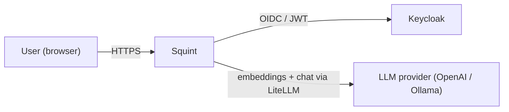
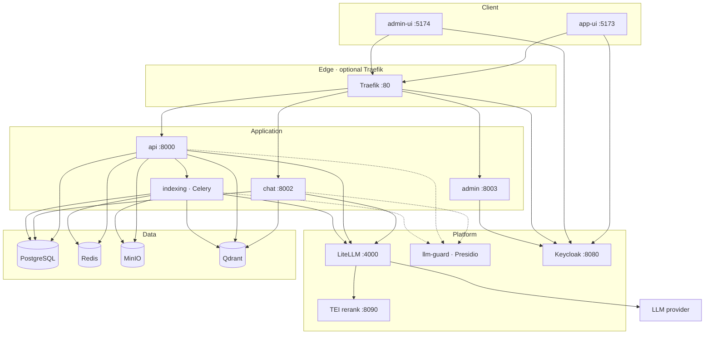
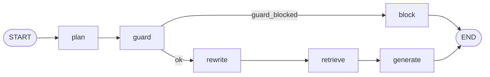
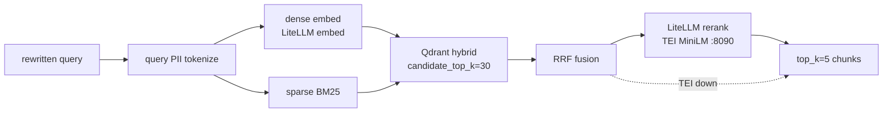
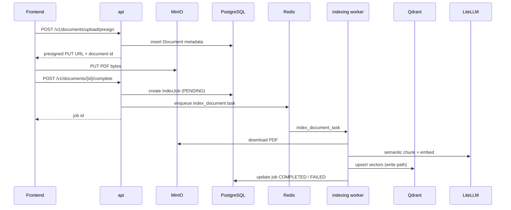

# Architecture

Phase 1 system design for **Squint**. Diagrams use [Mermaid](https://mermaid.js.org/) (renders natively on GitHub). For the “why” behind these choices, see [Project overview](project-overview.md).

---

## L1 — System context

Who uses the system and what sits outside the repo boundary.



---

## L2 — Containers

Runtime components in the order a request crosses them. **Keycloak** and **TEI rerank** are on the default demo. **Traefik** activates with `--profile auth`. llm-guard with `--profile guardrails`. Default compose publishes host ports (`:5173`, `:8000`, `:8002`, Keycloak `:8080`, TEI `:8090`). Stack recipes: [`tools/ops/README.md`](../tools/ops/README.md).



**Bootstrap:** `ops` runs `make initialization` (MinIO, demo PDFs) then `make bootstrap` (Alembic, users, reindex after apps are up), then **stays up** so `docker compose exec ops make initialization|bootstrap|teardown|…` works. It is not on the request path.

**Traefik** routes `/` → frontend, `/api` → api, `/chat` → chat, `/admin-api` → admin, `/admin` → admin-ui, `/realms` → Keycloak. JWT middleware sits on `/api`, `/chat`, and `/admin-api` except `/health` and `/ready`. `/guard` and `/analyzer` proxy llm-guard / Presidio when those profiles are up (no Keycloak JWT).

The auth overlay [`operations/compose.ingress.yaml`](../operations/compose.ingress.yaml) publishes **only Traefik `:80`**; the browser talks to the gateway, and services stay on the Docker network. App-side JWT validation is unchanged. Lab compose without the overlay still publishes app ports (`:8000` / `:8002` / `:8003`) for curl/eval. Recipes: [`tools/ops/README.md`](../tools/ops/README.md).

**Data stores:** api/chat/indexing persist in **Postgres**; api/indexing use **Redis** (Celery) and **MinIO** (PDF bytes). Chat SSE is direct — no broker.

**LiteLLM** is the only outbound LLM/embed/rerank client. Apps never call OpenAI or TEI directly. Alias `rerank` forwards to TEI (`cross-encoder/ms-marco-MiniLM-L-6-v2`). Retrieval fail-opens to hybrid RRF if TEI is down.

**Guardrails:** Chat uses llm-guard (prompt injection) + Presidio (PII). API and indexing call Presidio when vault / query tokenization is on.

---

## L3a — Chat agent graph

LangGraph workflow ([workflow.py](../services/chat/src/agentic_chat/core/graph/workflow.py)). Checkpointing persists session state in PostgreSQL.



| Node | Role |
|------|------|
| **plan** | Extract search intent from the user message |
| **guard** | PII redaction + prompt-injection check |
| **block** | Short-circuit with a safe refusal |
| **rewrite** | Query rewrite for retrieval |
| **retrieve** | In-process `RetrievalService`: hybrid Qdrant → RRF → optional LiteLLM/TEI rerank |
| **generate** | LiteLLM `generate` + citations; streamed over SSE |

---

## L3b — Retrieval read path

Shared domain lib in api and chat ([service.py](../packages/shared/src/agentic_shared/domains/retrieval/service.py)). Apps call LiteLLM; LiteLLM calls TEI. Fail-open: if TEI is down, the RRF order is kept.



---

## L3c — Document indexing flow

Heavy work stays in the Celery worker — **never sync in the API**.



---

## Services and ports

| Service | Port | Role |
|---------|------|------|
| **api** | 8000 | Documents, jobs, `/v1/retrieval/*`, annotations; enqueues Celery tasks |
| **chat** | 8002 | LangGraph agent, in-process retrieval, SSE streaming |
| **admin** | 8003 | Tenant/user admin (Keycloak Organizations REST) |
| **indexing** | — | Celery worker — semantic PDF chunking + Qdrant **write** |
| **ops** | — | `make initialization` (infra) then `make bootstrap` (migrate after apps), then idle operator |
| **frontend** (app-ui) | 5173 | React chat + documents UI |
| **admin-ui** | 5174 | React admin UI |
| **Traefik** | 80 | API gateway (`--profile auth`) |
| **Keycloak** | 8080 | Identity provider (default demo) |
| **LiteLLM** | 4000 | Internal chat + embedding + rerank proxy |
| **tei-rerank** | 8090 | Cross-encoder rerank (default demo) |
| **llm-guard** | 8010 | Prompt-injection classifier (`--profile guardrails`) |
| **presidio-analyzer** | — | PII detect sidecar (`--profile guardrails`) |
| **presidio-anonymizer** | — | PII redact sidecar (`--profile guardrails`) |

Traefik routes ([routes.yaml](../operations/traefik/dynamic/routes.yaml)): `/api` → api, `/chat` → chat, `/admin-api` → admin, `/admin` → admin-ui, `/` → frontend; `/guard` and `/analyzer` when guardrails profile is up.

---

## Layout (left → right)

| Zone | Components |
|------|------------|
| **Client** | app-ui (React + SSE), admin-ui |
| **Edge** | Traefik (`--profile auth`) — inbound HTTP only with the ingress overlay; default demo publishes host ports including Keycloak `:8080` |
| **Application** | ops, api, chat, admin, indexing (Celery) |
| **Platform** | LiteLLM (`:4000`); TEI rerank (`:8090`); llm-guard (`--profile guardrails`); Presidio (default demo) |
| **Data stores** | Postgres, Redis, MinIO, Qdrant |
| **External** | LLM provider (OpenAI / Ollama / …) |

Retrieval and persistence logic lives in `packages/shared` and runs **in-process** inside api/chat/indexing — not as separate containers.

---

## Key design decisions

| Area | Choice |
|------|--------|
| Heavy indexing | **Celery + Redis** (not FastAPI BackgroundTasks) |
| Chat | **Separate service** on `:8002` with SSE |
| Retrieval read path | **Shared domain lib** in-process (API + Chat) — [ADR 001](adr/001-why-mcp-boundary.md) |
| Qdrant write path | **Indexing worker only** |
| Files | **MinIO** object storage (presigned uploads) |
| State | **PostgreSQL** (documents, jobs, sessions, messages) |
| DI | **Dishka** with vertical module slices — [ADR 002](adr/002-service-and-module-settings.md) |
| Auth | Keycloak JWT / API key / none; tenant via `X-Tenant-Id` or JWT claim |
| Compliance hooks | Extension ports in `core/compliance` — [ADR 003](adr/003-compliance-extension-points.md), [compliance.md](compliance.md) |
| Frontend | Two apps + `@are/ui-core` AppShell — [ADR 005](adr/005-shared-ui-core-appshell.md) |
| Backend i18n | Shared JSON catalog for SSE / prompts / stored job keys — [ADR 006](adr/006-backend-i18n.md) |
| Soft tenancy | Shared DB + `tenant_id` / JWT claims — [ADR 009](adr/009-soft-tenancy-auth.md) |
| PoCs | Isolated `pocs/` harness + light `results/result.log` (gitignored) — [ADR 010](adr/010-poc-workflow.md) |

---

## Semantic chunking and retrieval defaults

Indexing pipeline ([pipeline.py](../services/indexing/src/agentic_indexing/modules/pdf_indexing/pipeline.py)):

| Setting | Default | Source |
|---------|---------|--------|
| Splitter | `SemanticSplitterNodeParser` | LlamaIndex |
| PDF pages | joined into one document before split | headings that span page breaks stay retrievable |
| Short headings | prepended to the next chunk | e.g. `Article. I.` stays with Section 1 |
| `semantic_buffer_size` | `1` | `INDEXING_PDF_SEMANTIC_BUFFER_SIZE` |
| `semantic_breakpoint_percentile_threshold` | `95` | `INDEXING_PDF_SEMANTIC_BREAKPOINT_PERCENTILE_THRESHOLD` |
| Embedding model | `embed` alias → `text-embedding-3-small` | LiteLLM (`EMBEDDING_MODEL`) |
| Chunk metadata | `doc_id`, `page`, `source_file`, `tenant_id` | set at index time |

Retrieval read path ([QdrantSettings](../packages/shared/src/agentic_shared/infrastructure/vector/settings.py)):

| Setting | Default | Notes |
|---------|---------|-------|
| `candidate_top_k` | `30` | Initial hybrid search pool from Qdrant |
| `top_k` | `5` | Final results after RRF + optional TEI rerank |
| Rerank | LiteLLM alias `rerank` → TEI MiniLM | default demo; fail-open to RRF |
| Collection | `agentic_rag_eval_hybrid` | Dense + sparse (BM25) vectors |

Live eval goldens ([dataset-investigation.json](../tests/eval/dataset-investigation.json)) are questions against the synthetic dossiers in [`resources/eval/`](../resources/eval/). Retrieval IR is Pydantic Evals against `POST /v1/retrieval/search` (`make eval-live` → `python tests/retrieval/main.py`, stdout print). Generation is DeepEval `evaluate()` against the running chat SSE API (`make eval-live-generation` → `python tests/generation/main.py`), judged by the LiteLLM `judge` alias (not `generate`). Shared knobs are `CoreSettings` (OpenAI-compatible key + api/chat URLs); suite gates sit in `tests/*/settings.py`. Config is `tests/eval/.env`. Native DeepEval markdown: [`reports/eval/`](../reports/eval/). Not in default CI.

---

## Repository layout

Each entity is a **standalone project** with its own lockfile, virtualenv (Python) or `node_modules` (Node), and `Makefile` that includes shared templates from `make/`. The root `Makefile` only fans out; `make/projects.mk` is the single project list.

```
make/
  projects.mk           PYTHON_PROJECTS, NODE_PROJECTS (single source of truth)
  python.mk / node.mk   sync, lint, unit-test, licenses
  licenses.mk           SBOM merge (cyclonedx-cli) + Grant policy gate
  templates/            scaffolds for new projects
ruff.toml / mypy.ini    shared Python lint/type config (extended per project)
eslint.config.base.js   shared ESLint flat config

packages/shared/        agentic-shared — domains, integrations, auth
packages/ui-core/       @are/ui-core — AppShell, auth, i18n, primitives ([ADR 005](adr/005-shared-ui-core-appshell.md))

services/api/           FastAPI — documents, jobs, retrieval REST
services/chat/          FastAPI + LangGraph + SSE
services/admin/         Keycloak Organizations admin REST
services/indexing/      Celery worker — PDF → chunks → Qdrant

frontend/app-ui/        React chat + documents UI
frontend/admin-app-ui/  React admin UI

tests/api/              Playwright BDD HTTP against live services (OpenAPI clients)
tests/eval/             retrieval IR + generation DeepEval + guardrails (investigation corpus)
tests/e2e/              Playwright BDD UI (needs running stack)

openapi/                committed OpenAPI YAML (api, chat, admin)
operations/             postgres, redis, minio, qdrant, litellm, rerank, keycloak, traefik, guardrails
```

**CI** runs a matrix over `make/projects.mk` entries: frozen `uv sync` / `npm ci`, per-project lint + tests, then a non-gating combined coverage report.

---

## Further reading

- [Project overview](project-overview.md) — problem statement and design principles
- [Compliance readiness](compliance.md)
- [ADR 001 — Retrieval domain boundary](adr/001-why-mcp-boundary.md)
- [ADR 002 — Service and module settings](adr/002-service-and-module-settings.md)
- [ADR 003 — Compliance extension points](adr/003-compliance-extension-points.md)
- [ADR 004 — No in-service Python integration tests](adr/004-no-in-service-integration-tests.md)
- [ADR 005 — Shared UI core and AppShell](adr/005-shared-ui-core-appshell.md)
- [ADR 006 — Backend i18n for server-emitted copy](adr/006-backend-i18n.md)
- [ADR 007 — No live-stack tests in default CI](adr/007-no-live-tests-in-ci.md)
- [ADR 008 — Repo metadata in CUE](adr/008-repo-metadata-in-cue.md)
- [ADR 009 — Soft multi-tenancy in Phase 1 auth](adr/009-soft-tenancy-auth.md)
- [ADR 010 — PoC workflow under `pocs/`](adr/010-poc-workflow.md)
